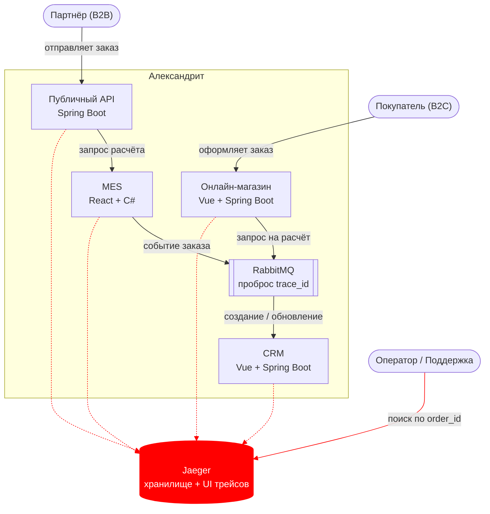
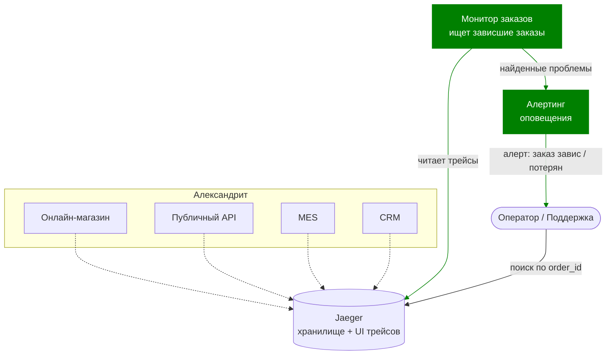

# Задание 3. Архитектурное решение по трейсингу

Технический документ: как внедрить трейсинг, чтобы команда видела, что происходило с заказом и где он находится сейчас.

**Идея в двух словах.** Каждому заказу присваивается сквозной идентификатор трассировки. Все сервисы передают его дальше по цепочке — в том числе через заголовки сообщений RabbitMQ. Все шаги (спаны) стекаются в одно хранилище, где по `order_id` видно весь путь заказа и точку, где он застрял.

---

## 1. Мотивация

Заказ проходит три системы и несколько очередей. Сегодня, когда клиент говорит «я не получил заказ», команда не может ответить, **где** он застрял: на расчёте, в потерянном сообщении, на ручном подтверждении в CRM или на доставке. Трейсинг показывает весь путь заказа по `order_id`: каждый шаг, его длительность и точку обрыва. Это заменяет многодневный разбор «со слов клиента» на поиск по `order_id`.

Метрики, на которые повлияет трейсинг:

1. **Время разбора инцидента (MTTR)** — снижается: путь заказа виден сразу.
2. **Время обнаружения проблемы (MTTD)** — снижается: зависшие заказы видны автоматически (см. раздел 7).
3. **Доля потерянных заказов** (не дошедших до CRM) — снижается: видно, на каком переходе теряется сообщение.
4. **Время прохождения заказа** (`SUBMITTED → PRICE_CALCULATED` и полный цикл) — становится измеримым.
5. **Нагрузка на поддержку** — снижается: поддержка сама находит статус заказа по `order_id`.

---

## 2. Что покрываем трейсингом и где заказ «ломается»

Заказ теряется и зависает в основном на границах систем и на асинхронных переходах через очереди. Места, которые нужно покрыть:

| # | Место / переход | Система | Чем рискуем |
|---|-----------------|---------|-------------|
| 1 | Оформление заказа: INITIATED → FILE_UPLOADED → SUBMITTED | Магазин | Тяжёлая 3D-модель, таймауты, потеря файла. |
| 2 | Запрос на расчёт: магазин/API → очередь → MES | Магазин, API, RabbitMQ | Потеря сообщения — заказ не доходит до расчёта. |
| 3 | Расчёт стоимости (2–30 мин) → PRICE_CALCULATED | MES | Зависание/очередь — самое вероятное узкое место. |
| 4 | Результат расчёта: MES → очередь → CRM | MES, RabbitMQ, CRM | Потеря сообщения — заказ не появляется в CRM (жалобы партнёров). |
| 5 | Подтверждение производства: MANUFACTURING_APPROVED | CRM | Ручной шаг — заказ может зависнуть на подтверждении. |
| 6 | Производство и отправка: STARTED → COMPLETED → PACKAGING → SHIPPED | MES | Задержки на производстве/упаковке. |
| 7 | Закрытие: SHIPPED → CLOSED (сообщение от транспортной компании) | CRM | Внешняя зависимость — сообщение может не прийти. |

**Приоритет покрытия:** сначала публичный API и MES + очереди между MES и CRM (здесь корень потерянных и зависших B2B-заказов), затем CRM, затем магазин.

---

## 3. Какие данные попадают в трейс

В каждом шаге (спане):
- Идентификаторы трассировки (`trace_id`, `span_id`) и **`order_id`** — по нему ищем заказ.
- `channel` (B2C/B2B), `partner_id`, `customer_id`.
- Имя сервиса, окружение (dev/release/prod).
- Название операции, для запросов — эндпоинт и код ответа.
- Смена статуса заказа: из какого статуса в какой.
- Для расчёта: сложность модели (число полигонов) и длительность.
- Для очередей: имя очереди, операция (отправка/получение), идентификатор сообщения, факт попадания в «недоставленные».
- Признак и текст ошибки (без чувствительных данных).

**Не кладём в трейс:** содержимое 3D-моделей и файлов, персональные данные сверх идентификаторов, платёжные данные.

---

## 4. Предлагаемое решение

### Технологии
- **OpenTelemetry** — открытый стандарт сбора трейсов. Есть библиотеки и для Java (магазин, CRM, API), и для C# (MES) — важно для смешанного стека.
- **Jaeger** — хранилище трейсов и веб-интерфейс для поиска пути заказа по `order_id`.

### Что нужно внедрить/доработать
- Подключить OpenTelemetry во все бэкенды (магазин, CRM, MES, API) — чтобы каждый сервис отправлял свои шаги.
- Передавать идентификатор трассировки **через заголовки сообщений RabbitMQ**, чтобы путь заказа не обрывался на асинхронных переходах. Это ключевой пункт.
- Во всех сервисах проставлять `order_id` в шаги трассировки.
- Развернуть Jaeger и подключить к нему все сервисы.
- Настроить выборку (sampling): сохраняем 100% трейсов с ошибками и по заказам на критичных переходах, остальное — частично, чтобы экономить хранилище.

### Схема (C4 Container) — новые элементы красным

**Новые элементы выделены красным**: Jaeger и пунктирные связи трейсинга (каждый сервис отправляет трейсы в Jaeger через OpenTelemetry). Остальное — существующий поток заказа.

---

## 5. Компромиссы

- **Расчётный модуль внутри MES.** MES куплен с исходным кодом, поэтому его C#-бэкенд инструментировать реально. Но если внутри есть закрытая библиотека расчёта, её внутренние шаги останутся «чёрным ящиком» — увидим только начало и конец расчёта. Углубляться в неё дорого и не нужно.
- **Транспортная компания** (переход SHIPPED → CLOSED) — вне нашего контроля; увидим только момент получения их сообщения, а не их внутренние шаги.
- **Стоимость хранения.** Хранить 100% трейсов при большом объёме дорого — поэтому используем выборку (полностью сохраняем только ошибки и критичные переходы).
- **Фронтенд.** Трейсинг фронтенда (Vue/React) для задачи «где заказ» почти ничего не даёт — на первом этапе не делаем.

---

## 6. Безопасность

- **Доступ только сотрудникам.** Веб-интерфейс Jaeger — за корпоративным входом (SSO); открыт только сотрудникам с актуальной учётной записью и нужной ролью (например, «Поддержка», «Разработка»). Наружу трейсинг не смотрит.
- **Разграничение по ролям и окружениям.** Доступ к трейсам прода — ограниченному кругу; dev/release — шире.
- **Чистка чувствительных данных.** Персональные и платёжные данные, содержимое файлов в трейсы не попадают; лишние поля вырезаются до записи.
- **Защита каналов.** Передача трейсов — по TLS; хранилище — в приватной сети, без публичного доступа.
- **Аудит доступа** — кто и какие трейсы смотрел.
- **Срок хранения** трейсов ограничен (например, 7–30 дней) — меньше данных, меньше рисков.

---

## 7. Дополнительно: автоматический мониторинг прохождения заказа и алертинг

Данные трейсинга можно использовать не только для ручного поиска, но и для автоматического наблюдения за потоком заказов.

**Как это работает:**
- Отдельный сервис («монитор заказов») читает данные трейсинга и ищет заказы, которые вошли в этап, но не завершили его за отведённое время (например, заказ в статусе `SUBMITTED`, но за N часов нет шага `PRICE_CALCULATED`).
- По таким заказам он поднимает алерт: «заказ завис на переходе X», «выросла доля заказов, не дошедших от магазина до MES» (признак потери сообщений), «расчёт идёт дольше обычного».
- Алерты уходят поддержке и дежурному — раньше, чем клиент пожалуется.

### Схема (обновлённая) — новые элементы зелёным

