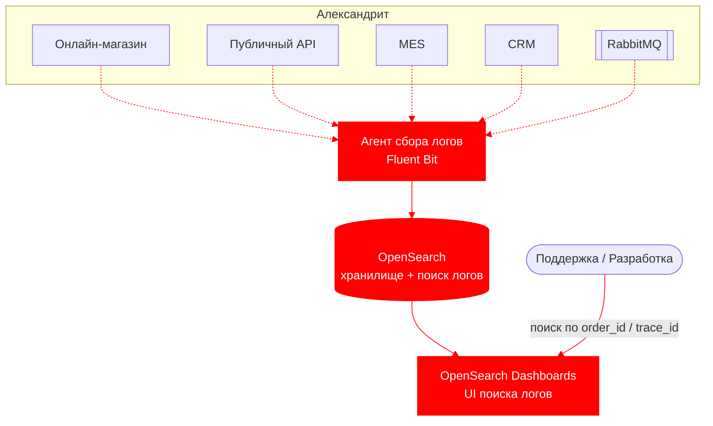

# Задание 4. Архитектурное решение по логированию

Технический документ: как внедрить централизованное логирование, чтобы упростить разбор проблем внутри сервисов и снизить нагрузку на поддержку.

**Идея в двух словах.** Каждый сервис пишет логи в едином структурном формате (JSON) с общими полями — включая `order_id` и `trace_id` из трейсинга. Агент собирает логи со всех инстансов в единое хранилище (OpenSearch), где по `order_id`/`trace_id` видно, что именно происходило внутри сервисов.

---

## 1. Мотивация

Сейчас ошибки разбираются «со слов клиента»: логи (если есть) разбросаны по инстансам, и чтобы понять, что произошло, уходит много времени поддержки и разработки. Централизованные структурные логи, связанные с трейсингом через `trace_id` и `order_id`, показывают, **что именно** случилось внутри сервиса: какое сообщение не обработалось, почему упал расчёт, на каком статусе застрял заказ. Поддержка переходит от расспросов клиента к поиску по `order_id` в логах.

Метрики, на которые повлияет логирование:

1. **Время разбора инцидента (MTTR)** — снижается: причина видна в логах, а не восстанавливается по рассказу.
2. **Нагрузка на поддержку** (время на тикет, число обращений к разработке) — снижается.
3. **Доля инцидентов, разобранных без разработчика** — растёт: поддержка сама находит причину.
4. **Время обнаружения аномалий и атак** (например, всплеск создания заказов) — снижается.
5. **Точность разбора потерянных заказов** — растёт: по логам отправки/получения сообщений видно, где оборвался путь.

---

## 2. Какие логи собираем

Логи собираем со всех компонентов, участвующих в жизненном цикле заказа (отмечены на схеме в разделе 4):
- Онлайн-магазин, CRM, MES, публичный API (бэкенды)
- RabbitMQ (логи брокера + записи об отправке/получении сообщений на стороне сервисов)
- Инфраструктура (системные логи EC2, логи managed-БД)

### 2.1. Логи уровня INFO

Каждая запись — структурный JSON с общими полями: время, уровень, сервис, окружение, `trace_id`, `order_id` (где применимо), сообщение.

| Событие (INFO) | Что логируем | Где |
|----------------|--------------|-----|
| Изменение статуса заказа | `order_id`, покупатель/партнёр, статус «из» → «в», канал | Магазин, MES, CRM |
| Создание заказа | `order_id`, канал, покупатель/партнёр | Магазин, CRM (B2B) |
| Загрузка 3D-модели / конструктор | `order_id`, размер файла, число полигонов (без содержимого) | Магазин |
| Отправка заказа (SUBMITTED) | `order_id`, покупатель | Магазин |
| Запрос на расчёт отправлен/получен | `order_id`, id сообщения, очередь | Магазин/API, MES |
| Расчёт начат/завершён | `order_id`, длительность, сложность модели, итоговая цена | MES |
| Отправка/получение сообщения из очереди | `order_id`, очередь, id сообщения, операция, результат | Магазин, MES, CRM |
| Подтверждение производства | `order_id`, id менеджера | CRM |
| Взятие заказа в работу | `order_id`, id оператора | MES |
| Этапы производства (STARTED/COMPLETED/PACKAGING/SHIPPED) | `order_id`, id оператора, этап | MES |
| Закрытие заказа (CLOSED) | `order_id`, источник (транспортная компания/вручную) | CRM |
| Входящий запрос публичного API | партнёр, эндпоинт, код ответа, длительность | API |
| Старт/остановка сервиса, деплой версии | сервис, версия | Все |

### 2.2. Другие уровни логирования

| Уровень | Когда используем |
|---------|------------------|
| **DEBUG / TRACE** | Детальная отладка конкретной проблемы. В проде выключены, включаются точечно и временно. |
| **INFO** | Нормальный ход бизнес-процесса (таблица выше). Основной уровень в проде. |
| **WARN** | Нештатная, но обработанная ситуация: повторная попытка отправки сообщения, деградация, приближение к лимиту, расчёт дольше обычного. |
| **ERROR** | Ошибка конкретной операции: не удалось обработать сообщение, ошибка расчёта или сохранения заказа, ошибка 5xx на API. |
| **FATAL** | Сервис не может работать (недоступна БД, не стартует). Немедленное оповещение дежурному. |

---

## 3. Что настраиваем в первую очередь (логирование и трейсинг)

Команда не сможет покрыть логированием и трейсингом все системы сразу. Приоритет:

**В первую очередь — публичный API, MES и очереди между MES и CRM.**
- Здесь сосредоточены главные жалобы: партнёры не получают заказы (потеря сообщений на пути API → MES → очередь → CRM) и заказы застревают на расчёте в MES. Это область прямой потери контрактов и выручки.
- B2B-путь идёт в обход браузера, поэтому Яндекс.Метрика его не видит — здесь меньше всего наблюдаемости.
- Связка «трейсинг (где заказ) + логи (почему)» на этом участке даёт максимальный эффект.

**Во вторую очередь — CRM** (создание, подтверждение, закрытие заказа), **затем магазин** (начало пути, B2C-воронка). Инфраструктурные логи собираем параллельно как дешёвый базовый уровень.

---

## 4. Предлагаемое решение

### Технологии
- **Единый формат логов** — структурный JSON во всех сервисах, с общими полями (`order_id`, `trace_id`, сервис, окружение). Это позволяет искать и фильтровать по полям, а не по тексту.
- **Агент сбора логов** (например, Fluent Bit) на каждом инстансе — читает логи и отправляет их в хранилище.
- **OpenSearch** — хранилище логов и поиск; **OpenSearch Dashboards** — веб-интерфейс поиска.
- Для устойчивости к всплескам между агентом и хранилищем можно поставить буфер, чтобы не терять логи на пиках.

### Что нужно внедрить/доработать
- Включить структурное логирование во всех бэкендах и прокидывать в логи `order_id` и `trace_id`.
- Поставить агент сбора на все инстансы.
- Развернуть OpenSearch (можно managed в Yandex Cloud) и Dashboards.
- Настроить очистку чувствительных данных при сборе (см. раздел 5).

### Схема сбора логов (новые элементы — красным)

**Новые элементы выделены красным**: агент сбора, OpenSearch и Dashboards, а также связи сбора логов.

---

## 5. Безопасность и хранение логов

### Чувствительные данные
- **Не логируем:** пароли, токены, платёжные данные, содержимое 3D-файлов, полные персональные данные. Идентификаторы (`order_id`, `customer_id`, `partner_id`) — можно.
- **Маскирование** на этапе сбора: email и телефоны маскируются или заменяются на хеш.
- Соблюдаем требования к персональным данным.

### Доступ к логам
- Доступ только сотрудникам через корпоративный вход (SSO), с разграничением по ролям (Поддержка / Разработка / Администратор) и по окружениям.
- Логи прода с чувствительными данными — ограниченному кругу.
- Ведём аудит доступа (кто что искал). Передача логов — по TLS, хранилище — в приватной сети.

### Сроки и объём хранения
- Отдельные индексы по сервису и дате; отдельно — логи безопасности и аудита.
- Обычные логи храним недолго (например, 30–90 дней), логи ошибок и безопасности — дольше (полгода–год) для расследований.
- Старые логи сжимаем; при быстром росте заказов закладываем рост объёма (десятки–сотни ГБ в месяц) и следим за диском (см. Task 2). Точные сроки калибруем после запуска.

---

## 6. От сбора логов к анализу

Логи нужны не только для ручного поиска — на их основе настраиваем автоматические сигналы.

**Алертинг:**
- Всплеск ошибок (ERROR/FATAL) по сервису — например, рост ошибок в MES.
- Ошибки отправки/получения сообщений в очередях или рост недоставленных сообщений — корень потерянных заказов.
- Отсутствие ожидаемых событий (например, за N часов ни одной смены статуса по активным заказам) — «поток встал».

**Поиск аномалий:**
- Резкий всплеск создания заказов (было 4 записи, за секунду стало 10 000) — возможная атака или злоупотребление API → сигнал + автоматическое ограничение потока/блокировка партнёра.
- Аномальный рост длительности расчёта или ошибок у конкретного партнёра.

Так система сбора логов превращается в систему анализа: не просто «складываем логи», а автоматически находим инциденты, атаки и остановки потока заказов, связывая их с трейсами (Task 3) и метриками (Task 2).

---

## 7. Дополнительно: критерии выбора технологии

| Критерий | ELK (Elastic) | OpenSearch | Splunk | Grafana Loki |
|----------|---------------|------------|--------|--------------|
| **Лицензия** | Elastic License (с ограничениями) | Apache 2.0 (полностью открытая) | Проприетарная | AGPLv3 (открытая) |
| **Стоимость** | Ядро бесплатно, часть функций платно | Бесплатно, включая безопасность | Дорого (по объёму данных) | Дёшево |
| **Полнотекстовый поиск** | Отличный | Отличный | Отличный | Ограниченный (по меткам) |
| **Managed в Yandex Cloud** | Частично | **Да** | Нет | Через self-host |
| **Поиск аномалий / ML** | Есть (платно) | Есть (бесплатно) | Есть (сильный) | Ограниченно |
| **Порог входа** | Средний | Средний | Низкий, но дорого | Низкий |

**Выбор: OpenSearch.**
- **Плюсы:** открытая лицензия (нет юридических рисков и привязки к вендору), бесплатные безопасность и поиск аномалий, есть managed-вариант в Yandex Cloud (наш провайдер), совместимость с экосистемой Elasticsearch.
- **Минусы:** если не managed — нужно сопровождать самим; меньше готовых enterprise-функций, чем у Splunk.
- **Почему не Splunk:** мощный, но проприетарный и дорогой — при взрывном росте заказов расходы плохо предсказуемы.
- **Почему не Loki:** дёшев, но слабый полнотекстовый поиск — для разбора инцидентов по произвольным полям нужен полноценный поиск.
