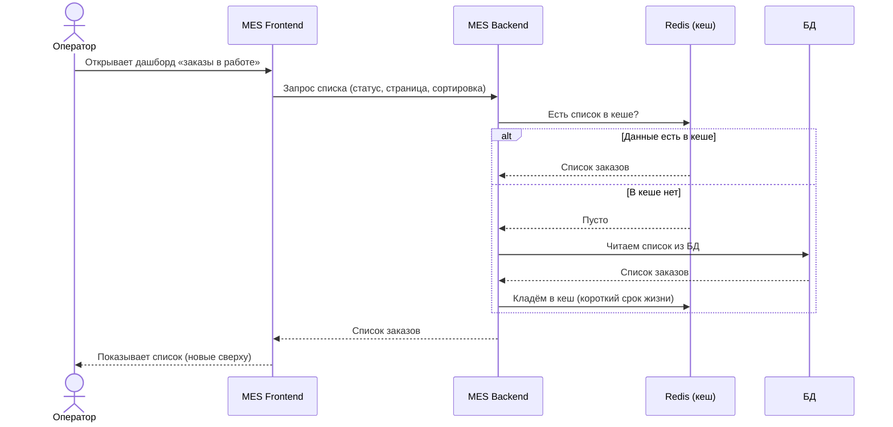
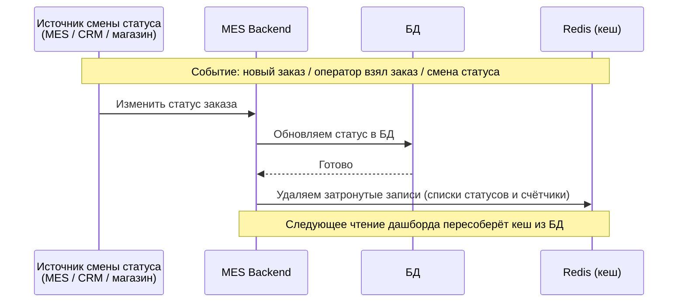

# Задание 5. Архитектурное решение по кешированию

Технический документ — справочный артефакт для бизнеса и команды: что кешируем в MES, как и почему.

**Идея в двух словах.** Дашборд «заказы в работе» — самый частый и тяжёлый запрос, одинаковый для многих операторов. Кладём его результат в общий серверный кеш (Redis); при смене статуса заказа сбрасываем затронутые записи кеша.

---

## 1. Что кешируем и мотивация

**Что кешируем.** Первую страницу MES — дашборд «заказы в работе» (список заказов по статусам с фильтром и пагинацией, сортировка «новые сверху»). Конкретно — результат запроса «список активных заказов по статусу, страница N, сортировка по дате» и счётчики заказов по статусам (бейджи фильтра).

**Почему кеширование.** Сейчас дашборд грузится медленно даже с фильтром и пагинацией. Причины:
- запрос идёт по всей растущей таблице заказов (активные вперемешку с закрытыми);
- тяжёлая сортировка и фильтрация без подходящих индексов;
- единственный инстанс БД на чтение и запись — тяжёлые чтения дашборда конкурируют с записями статусов;
- один и тот же запрос выполняется многократно, потому что операторы часто обновляют страницу.

Дашборд — самая горячая и повторяемая операция чтения, одинаковая для многих операторов, поэтому это идеальный кандидат на кеш. Кеш решает сразу две проблемы: **дашбордом неудобно пользоваться из-за долгой загрузки** и **тяжёлые чтения нагружают единственную БД**. Закрытые/архивные заказы через этот кеш не идут — они относятся к «холодному» хранилищу.

---

## 2. Предлагаемое решение

### 2.1. Клиентское или серверное кеширование?

**Выбираем серверное кеширование (Redis).**

- Данные общие для многих операторов и должны быть согласованными: один взял заказ — остальные должны сразу это увидеть. Клиентский кеш у каждого свой и быстро расходится с реальностью (оператор увидит «свободным» заказ, который уже взяли).
- Главная цель — разгрузить БД. Это делает только серверный общий кеш; клиентский нагрузку на БД не снимает.

Клиентское кеширование (в браузере) уместно лишь как дополнение — для статики и неизменных ресурсов, но не для согласованного «горячего» списка заказов.

**Технология:** Redis (managed в Yandex Cloud) — общий кеш для бэкенда MES.

### 2.2. Паттерн: Cache-Aside + событийная инвалидация

**Выбираем Cache-Aside** для чтения списка + **сброс кеша по событию** при смене статуса.

*Как работает:* приложение сначала смотрит в кеш. Если данные есть — отдаёт их; если нет — читает из БД, кладёт результат в кеш (с коротким сроком жизни) и отдаёт. При смене статуса заказа приложение удаляет из кеша затронутые записи.

*Почему Cache-Aside:*
- Кешируется только то, что реально запрашивают, — экономно по памяти.
- Надёжно: если кеш недоступен, приложение просто читает из БД (кеш не мешает работе).
- Просто внедрить и понятно для команды.

*Почему не другие паттерны:*
- **Write-Through** (писать в кеш при каждой записи): статусы меняются в трёх системах (магазин/CRM/MES), в том числе через RabbitMQ — синхронно поддерживать кеш при каждой записи сложно и хрупко. К тому же кешируем не отдельные заказы, а готовые страницы списка, которые Write-Through напрямую не обслуживает.
- **Refresh-Ahead** (заранее обновлять кеш до истечения срока): хорош для предсказуемо-горячих данных, но сам по себе не гарантирует мгновенного появления только что созданного заказа и тратит ресурсы на обновление невостребованных страниц. Рассматриваем его как альтернативу в разделе 3.

### 2.3. Диаграммы последовательности

**(A) Чтение списка заказов (Cache-Aside):**

**(B) Запись смены статуса заказа (сброс кеша):**

Участники кеширования: **MES Frontend → MES Backend → Redis → БД**. Смена статуса может прийти и из других систем (CRM, магазин) через RabbitMQ — обработчик в MES тоже сбрасывает кеш.

### 2.4. Стратегия инвалидации

**Выбираем комбинацию: сброс по событию (основной) + короткий срок жизни записи как страховка.**

- **По событию:** при любой смене статуса (в MES или пришедшей из RabbitMQ от CRM/магазина) удаляем затронутые записи кеша. Это гарантирует, что новый или изменённый заказ появляется в дашборде сразу.
- **Короткий срок жизни (30–60 с):** на случай, если событие сброса потерялось, кеш всё равно обновится сам. Большой срок не ставим — иначе операторы увидят устаревший список.

*Почему не только по сроку жизни:* большой срок — устаревшие данные, маленький — кеш почти не помогает и нагрузка на БД возвращается.
*Почему не ручной сброс без событий:* легко «забыть» сбросить кеш при изменении из другой системы, и данные разойдутся.

| Событийный сброс + срок жизни (выбрано) | Только по сроку жизни | Только ручной сброс без событий |
|---|---|---|
| Новые/изменённые заказы видны сразу + страховка от потерянных событий. | Проще всего, но данные либо устаревшие, либо кеш почти бесполезен. | Точечно, но легко пропустить изменение из другой системы → рассинхрон. |
| Чуть сложнее: нужна подписка на события смены статуса (в т.ч. из RabbitMQ). | Не отражает смену статуса мгновенно. | Не реагирует автоматически на изменения из других систем. |

**Ключи кеша:** `orders:{статус}:{страница}:{сортировка}` для страниц и `counters:{статус}` для счётчиков. Если Redis недоступен — читаем напрямую из БД (медленнее, но без отказа).

---

## 3. Дополнительно: сравнение двух решений

Так как «новые сверху» — предсказуемо горячие данные, у Cache-Aside есть достойная альтернатива — Refresh-Ahead. Сравним.

| | **Решение 1 — Cache-Aside + событийный сброс** | **Решение 2 — Refresh-Ahead (заранее обновляем кеш)** |
|---|---|---|
| **Описание** | Читаем из кеша, при промахе — из БД и заполняем; сброс по событию смены статуса + короткий срок жизни. (Диаграммы в разделе 2.3.) | Фоновый процесс заранее пересобирает горячие страницы дашборда, операторы почти всегда читают свежий кеш. |
| **Плюсы** | Экономно по памяти; надёжно (при сбое кеша читаем из БД); просто; данные свежие за счёт событий; хорошо ложится на три системы + RabbitMQ. | Стабильно быстрый отклик (почти нет промахов); ровная нагрузка на БД. |
| **Минусы** | Возможны редкие «холодные» промахи с всплеском запросов к БД. | Сложнее; обновляет и невостребованные страницы (лишняя работа); всё равно нужен событийный сброс для мгновенного появления новых заказов. |

**Вывод.** Рекомендую **Решение 1 (Cache-Aside + событийный сброс)** как основное: проще, надёжнее и точно отражает смену статусов из всех трёх систем. Элементы **Refresh-Ahead** можно добавить позже — для самых горячих страниц, если метрики (Task 2) покажут, что холодные промахи всё ещё заметно нагружают БД. Такой поэтапный подход даёт быстрый эффект сейчас и оставляет пространство для оптимизации по данным.
